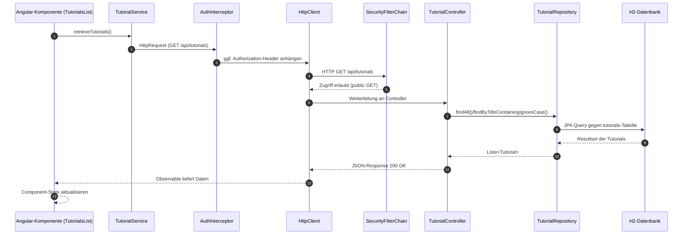

# Request-Verlauf vom Angular-Frontend bis zur H2-Datenbank

Der folgende Ablauf beschreibt exemplarisch einen Lesezugriff auf die Tutorial-Ressource (GET `/api/tutorials`), wie er in der bestehenden Anwendung ausgelöst wird. Die Schritte lassen sich analog auf Schreiboperationen übertragen, weil dieselben Infrastruktur-Komponenten (Interceptor, Security-Filter, JPA-Repository) beteiligt sind.

## Ablauf in Schritten
1. **Angular-Komponente** – Beim Laden der Listenansicht ruft `TutorialsListComponent` die Methode `retrieveTutorials()` auf und löst damit `tutorialService.getAll()` aus, um alle Tutorials vom Backend zu holen.
2. **Service + HTTP-Client** – `TutorialService` erstellt einen GET-Request auf `http://localhost:8080/api/tutorials` und gibt das Observable weiter. Falls der Nutzer eingeloggt ist, hängt der `AuthInterceptor` über `AuthService.getAuthHeader()` einen `Authorization: Basic ...` Header an.
3. **Spring Security** – Der Request erreicht den `SecurityFilterChain`. Laut Konfiguration sind GET-Requests auf `/api/tutorials/**` generell freigegeben; andere Endpunkte erfordern eine erfolgreiche Basic-Auth. CSRF ist deaktiviert, die Session-Strategie ist stateless.
4. **REST-Controller** – `TutorialController.getAllTutorials()` verarbeitet den Request. Optionaler Query-Parameter `title` wird genutzt, um nach Titelfragmenten zu filtern; ohne Parameter werden alle Tutorials geladen. Fehler führen zu HTTP 204 (kein Inhalt) oder 500.
5. **Repository + JPA** – Der Controller delegiert an `TutorialRepository` (`findAll()` oder `findByTitleContainingIgnoreCase(...)`). Spring Data JPA übersetzt die Methode in die passende SQL-Abfrage gegen die H2-Datenbank.
6. **Datenbank** – Die H2-Instanz ist als Datei-Datenbank (`jdbc:h2:file:./testdb`) konfiguriert. Hibernate kümmert sich um Schema-Updates (`ddl-auto=update`) und führt die selektierte Abfrage aus.
7. **Antwort** – Die gefundenen `Tutorial`-Entitäten werden vom Controller als JSON zurückgegeben. Angular erhält die Daten über das Observable, aktualisiert `tutorials` im Component-State und rendert die Liste.

## Sequenzdiagramm

## Wichtige Konfigurationsdetails
- **Auth & Interceptor**: Basic-Credentials werden in `localStorage` gehalten und automatisch gesetzt, wenn verfügbar. Dadurch bleiben schreibende Requests authentifiziert, ohne dass jeder Service-Aufruf dies selbst erledigen muss.
- **Sicherheit**: GETs auf Tutorials sind öffentlich, POST/PUT/DELETE erfordern Authentifizierung. H2-Konsole ist freigeschaltet (`/h2-ui/**`), Frame-Optionen sind entsprechend konfiguriert.
- **Persistenz**: Die Anwendung nutzt eine lokale H2-Datei-Datenbank, die SQL-Ausgabe aktiviert (`spring.jpa.show-sql=true`) und das Schema bei Bedarf aktualisiert.
